> ContextualAnimationk教程参考：[vorixo.github.io/devtricks/contextual-anim](https://vorixo.github.io/devtricks/contextual-anim/)

# PART 01 处决动画

## 动画序列与蒙太奇

确保动画序列开启Root Motion

设置动画蒙太奇的Montage Section

Attacker

Victim

## 插件

添加插件Motion Warping 和ContextualAnimation

## 角色蓝图Mesh

Player和Enemy都设置Rotation.Z为-90

## Contextual Anim

创建DataAsset(Contextual Anim Roles Asset)

创建Contextual Anim Scene

然后新建AnimSet

设置AM_Attacker的Mesh属性

## 动画蒙太奇的MotionWarping点

设置MotionWarping点——Notify State

让MotionWarping点处于AM_Attacker的Enter阶段

处于AM_Victim的Enter阶段稍微靠后

设置好WarpTargetName

> `Warp Target Name` 是 **Motion Warping（运动扭曲）** 中用于指定“要朝哪个目标进行根运动校正”的 **标识名** 。这是一个 `FName` 键。动画播放到这个带有 `Skew Warp` 的 Anim Notify State 区间时，系统会去角色的 `MotionWarpingComponent` 中查找名为 `Attacker` 的 Warp Target。找到后，会在该 Notify 的时间段内动态修正动画的 Root Motion，使角色尽量对齐到这个目标的位置和/或朝向。

BlendIn设置为Inertialization(带惯性)

记得在动画蓝图中添加Inertialization节点

回到Contextual Anim Scene，设置

点击更新Warp点

## AnimNotifyBlueprint与触发事件

新建AnimNotifyBlueprint

添加函数继承ReceivedNotify接收通知

在Enemy的角色蓝图中添加球形触发器

添加碰撞重叠触发事件

添加推开敌人事件和重置事件

AnimNotifyBlueprint中的接收函数逻辑如下：

在AM_Attacker中的Exit阶段的末尾添加该AnimNotify

## 交互键

在Player的角色蓝图中添加交互键触发事件

## 最终效果

不按推开交互键

按交互键

# PART 02 QTE处决动画

### WidgetBlueprint UI

元素

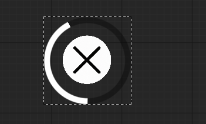

UI动画

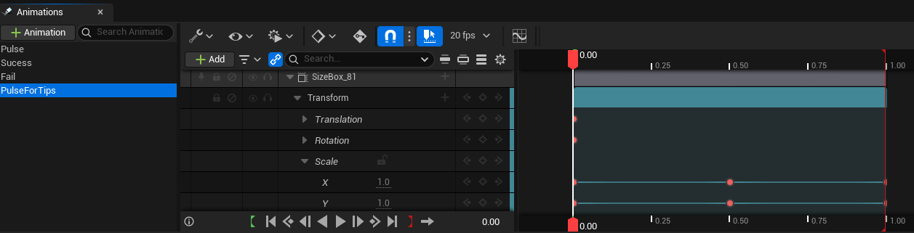

函数

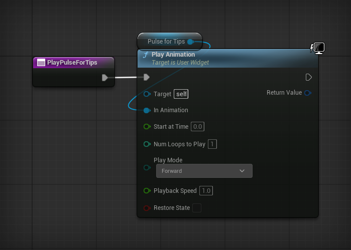

## BP_Player

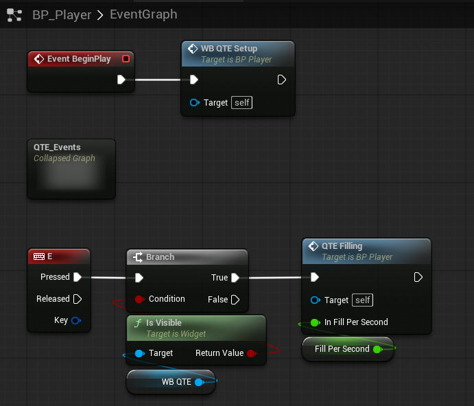

### WB_QTE_Setup

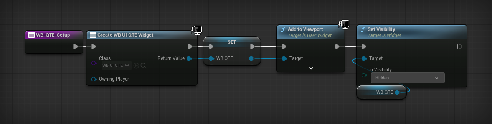

### QTE_Events

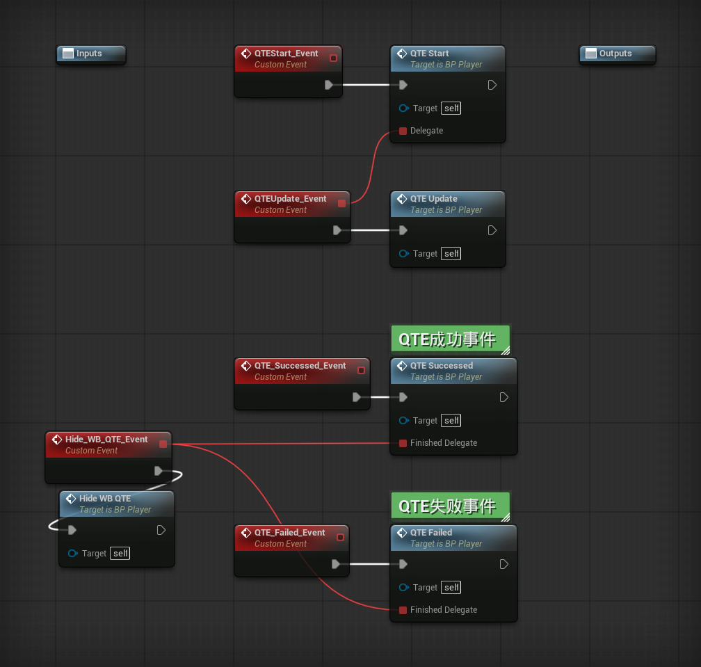

#### QTE_Start

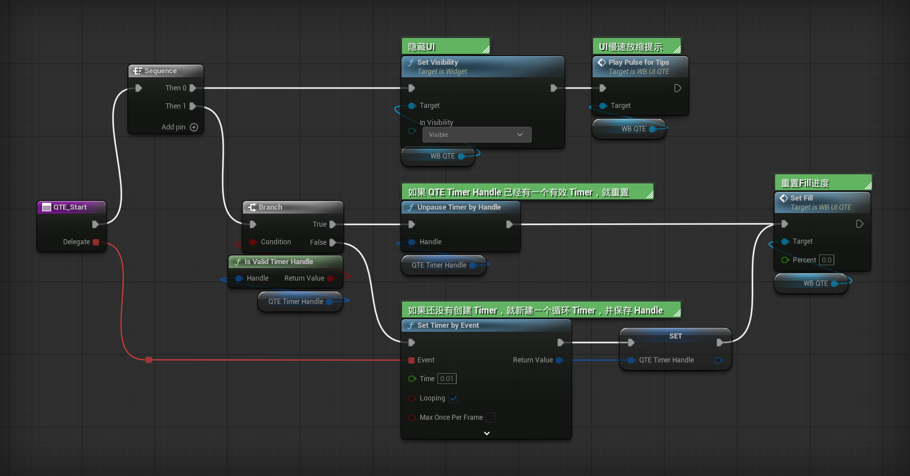

#### QTE_Update

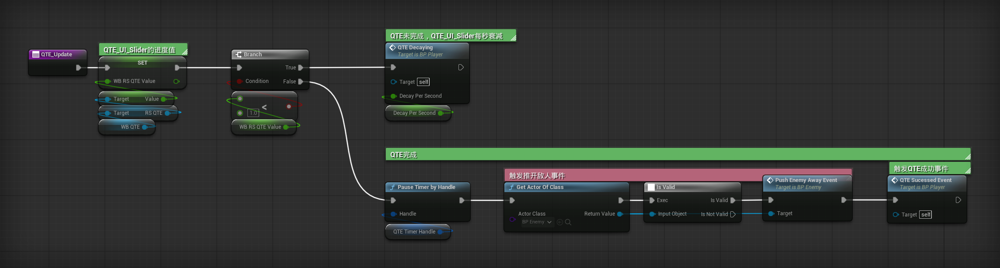

#### QTE_Successed

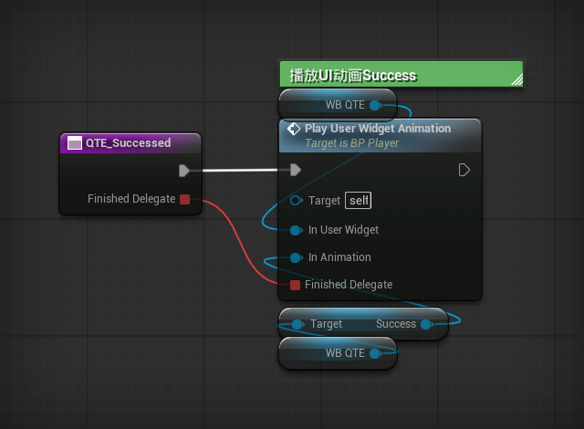

#### QTE_Failed

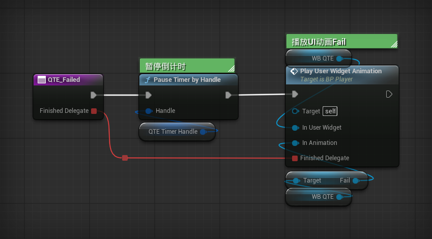

#### Hide_WB_QTE

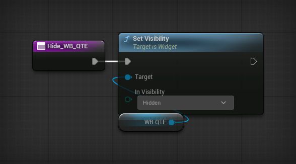

### QTE_Filling

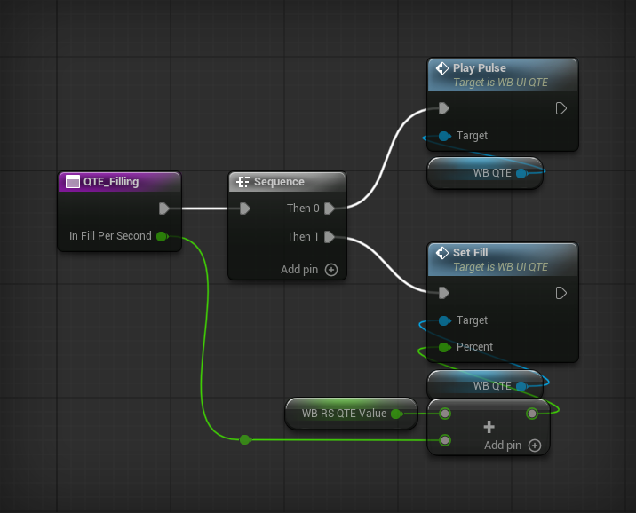
